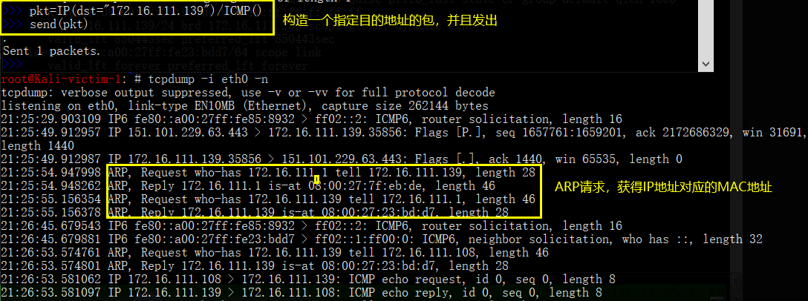
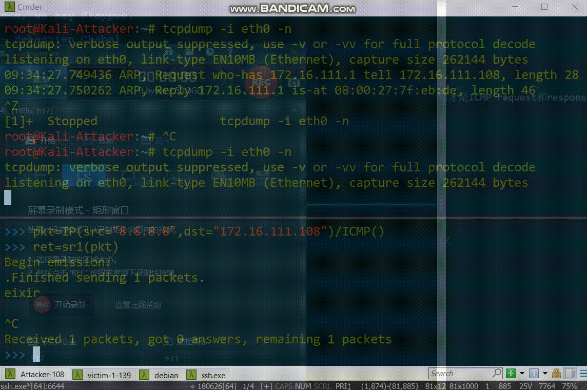
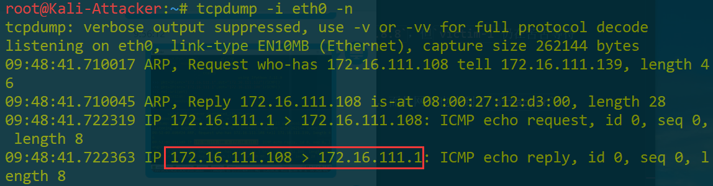
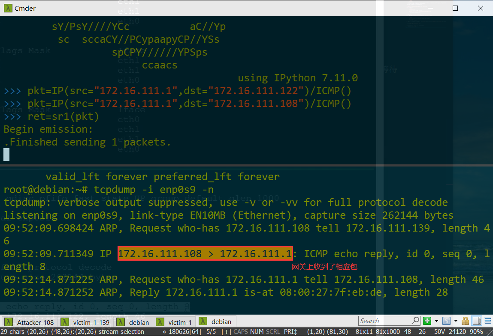

- [ ] 信息收集的常见方法 (33:52)
- [ ] 网络扫描基本原理 (01:08:18)
- [x] 网络扫描过程中的抓包分析实战 (12:06)
- [ ] nmap 基本使用 (16:35)
- [x] 使用 scapy 进行网络扫描的实验环境准备 (06:36)
- [x] scapy 使用入门 (50:43) 可以替代namp 80% 的功能
- [x] 第五章课后作业的实验环境搭建小提示 (13:14)
- [ ] 关于「端口」状态和操作的表达方式讨论 (09:50) 听懂了一半一半

- scapy使用
  - `help(函数) help(IP)`查看帮助信息，`:q退出 / 进行搜索` 
  - [更新scapy](https://scapy.readthedocs.io/en/latest/installation.html)
    一般装不好python的库，很有可能是网络原因，下次再试。
    ```
    pip install --pre scapy[complete]
    ```
  - 构造数据
    ```bash
    # IP数据
    pkt = IP()
    # 构造一个基本数据包 IP头 默认大写
    # 源地址目的地址 默认本地回环地址
    # dst改成网关地址
    # 局域网中源地址欺骗

    pkt.show() 
    # 看结果

    pkt.dst=""

    # ICMP协议
    pkt2=IP()/ICMP()
    # / 重载运算符 底层往高层进行数据封装
    # ping的命令

    pkt.show2()
    
    pkt.summary()
    # 查看概要信息

    ls(pkt)
    ls()
    # 当前scapy支持的所有数据类型

    lsc()
    # 列举scapy内置的函数 函数名称 基本描述（基本功能）

    pkt=Ether()/IP()/ICMP()
    # 从以太帧开始构造

    # ICMP协议隧道 传输一些自定义的数据
    pkt=Ether()/IP()/ICMP()/"hello world"
    # 基于ICMP的隐蔽通信

    pkt2layer=Ether()/IP(dst="www.baidu.com")/ICMP()
    # 构造二层数据包
    ret=srp1(pkt2layer)
    # 通过修改Ether头部信息，修改MAC地址，达到arp欺骗，链路层进行数据伪装
    ```
  - 发送数据
        ```bash
        send(pkt)
        ```
    虽然编程只发送了一个数据包，底层帮助发送了ARP请求，广播。后面才是ICMP request和response。ARP的广播，取决于系统栈，ARP会周期更新缓存表。
    没有IP和MAC地址映射关系的时候要发包
        
    
  - 查看scapy版本
        ```bash

        pip3 show scapy
        # 找到location 在后面加入/scapy
        python3 /usr/local/lib/python3.7/dist-packages/scapy
        # 运行刚刚下载的新版的scapy
        ```
  - 查看返回结果
        ```
        ret
        # 查看摘要信息
        ret.show()
        ret[ICMP/IP/Ether]
        ret[ICMP].type
        ret[ICMP].fields
        ```
  - scapy进行抓包
        ```
        pkts=sniff(iface='eth0',count=100)
        # 阻塞模式的抓包

        nmap ip地址 -A -T -n -vv 快速产生数据

        pkts.nsummary()
        pkts[99][IP]
        # 看第99个数据包
        ```
  - vscode的remote环境
  - 编程
        ```
        vim ping.py

        from scapy.all import *
        pkt=IP(dst="")/ICMP()
        for i in range(0,10):
            send(pkt)

        python3 ping.py

        pkts=rdpcap("ping.cap")
        # 读取抓到的数据包

        wrpcap保存
        ```
- 源地址欺骗
  - `victim-1`向`attacker`发送数据包
  - 伪造谷歌的服务器向`attacker`发送数据包，`attacker`进行抓包

        ```bash
        pkt=IP(src="8.8.8.8",dst="172.16.111.108")/ICMP()
        ret=sr1(pkt)
        # send and receive 
        ```
  - 局域网伪造的IP地址，发送成功，而且`attacker`响应斌且发送给`8.8.8.8`，但`victim-1`仍在苦苦等待
  
    
  - 在网关上抓包，`victim-1`伪造网关给`attacker`发送数据，发送成功，而且网关也收到了`attacker`的响应。
        
        
  - 局域网：基于源地址欺骗的拒绝服务攻击
    - 攻击者可以大量伪造不同目的地址的数据包，而源地址都指向受害者
    - 根据源地址回应消息
    - 分布式拒绝服务攻击
  - 存储转发：
    - ARP表根据目的地址转发
    - 路由表`route -n`
    - ipv4转发的天然缺陷：根据目的地址转发，匹配arp表和route表
    - 对来源ip地址设置`白名单`，不在白名单上的数据不能转发 
- 网络的设置优先选择NAT network
    ```bash

    ```
- NAT network 和 NAT 的区别
  - NS的实验用NAT network / openwrt的实验用 NAT
  - 涉及到互联网发送数据，一定要用NAT network
    - NAT network对应的虚拟机，相互之间具有连通性
    - 同一个NAT，不具备连通性
  - 实验测试
    - `Debian`的NAT网络的地址`enp0s3` -> `10.0.2.15/24`
    - 修改网卡类型
      - 不重启系统的情况下重启网络`ifdown enp0s3 && ifup enp0s3`，对指定的网卡重启，先把网卡关闭再启用。
      - 修改后，网关和内网靶机连通性无问题，`enp0s3`的ip地址未发生改变
            ```bash
            pkt=IP(dst="www.baidu.com")/ICMP()
            ret=sr1(pkt)
            # NAT 网络 可以成功
            # NAT 数据包等待 无法成功
            ```
      - 涉及到外网的实验，用NAT网络
- 关于「端口」状态和操作的表达方式讨论
  - 传输层概念
    - TCP
    - UDP
    - 两者的区别
      - UDP stateless 无状态协议 没有端口的开放或者关闭概念
      - TCP的状态机：
            ```
            closed 
            listen 
            establish 
            closing 
            time wait

            open
            half open 
            # 三次握手没有完成

            # 没有打开和关闭端口的说法
            ```
            防火墙的角度：端口开放或关闭
            客户端访问服务器：reachable和unreachable 可达和不可达 连通或不连通
            监听：从进程角度，识别 OPEN CLOSE FILTER 防火墙特有的状态
  - 防火墙会改变端口状态
        
            