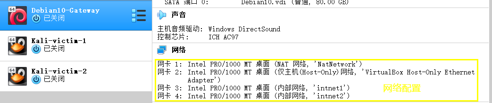
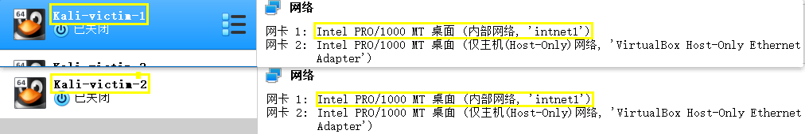
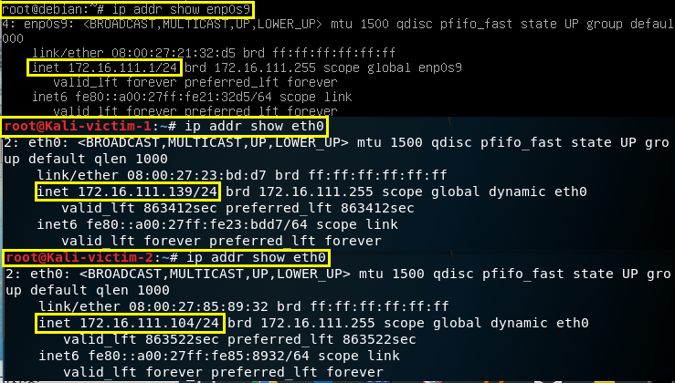
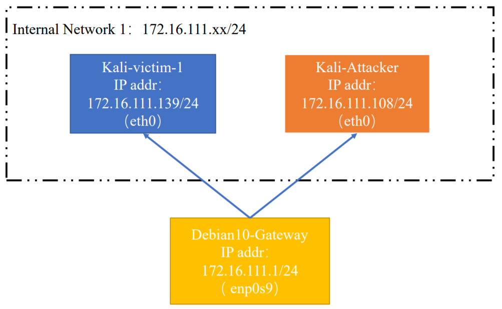
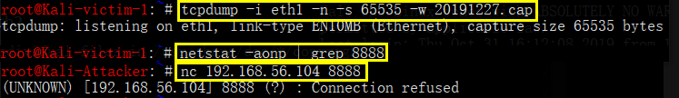
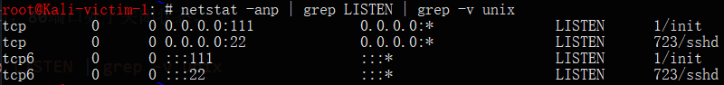
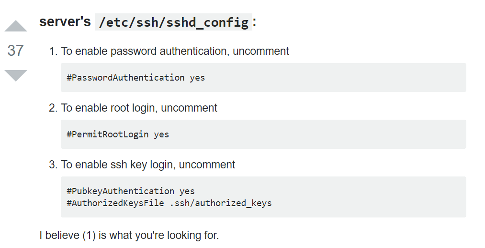
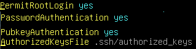

# 基于 Scapy 编写端口扫描器

## 实验目的

- 掌握网络扫描之端口状态探测的基本原理

## 实验环境

- python + scapy
- 网络拓朴的搭建
  - 一个网关 Debian10-GW
    - 物理层的保证

        
    - 第一张网卡：为了后面讨论`NAT和NAT Network在外网探测的显著区别`。
    - 第二张网卡：为了方便主机远程控制
    - 第三、四网卡：划分两个独立子网
  - 两台靶机 Kali-victim-1 Kali-victim-2
    - 主要只需要一个内部网络
    - 第二张为了方便主机远程控制
    - 确保两台靶机的网络是一致的，通信效果上这两个靶机在同一个局域网上

        
  - 攻击者Attacker和靶机在同一个内网（好像上面只需要一个靶机，看自己的拓扑图如何搭建）
  - 判断靶机和攻击者主机可以相互ping通
  - 打开虚拟机进行查看机器的IP地址，物理层保障，`ip addr show eth0`仅查看某个网卡的信息

        
  - 验证内部网络的连通性。
- 网络拓朴做了调整
  - 扫描实验的方便，把攻击者主机和靶机放在同一个局域网中
- 拓扑图绘制
  - 网关的地址
    - host-only 192.168.134.4/24
    - 内部网络1 172.16.111.1/24
    - 内部网络2 172.16.222.1/24
  - 靶机的地址
    - 172.16.111.139/24
  - 攻击者
    - 172.16.111.108/24
  
  

- 待探测窗口可以自行设置 开放、关闭 和 过滤 状态
  - 开放的模拟
    - 有没有进程、应用程序在该端口上

## 实验要求

- [x] 禁止探测互联网上的 IP ，严格遵守网络安全相关法律法规，不要在互联网上做扫描实验，只推荐在局域网
- 完成以下扫描技术的编程实现
  - [ ] TCP connect scan / TCP stealth scan
  - [ ] TCP Xmas scan / TCP fin scan / TCP null scan
  - [ ] UDP scan
- 上述每种扫描技术的实现测试均需要测试端口状态为：开放、关闭 和 过滤 状态时的程序执行结果
- [ ] 提供每一次扫描测试的抓包结果并分析与课本中的扫描方法原理是否相符？如果不同，试分析原因；
- [ ] 在实验报告中详细说明实验网络环境拓扑、被测试 IP 的端口状态是如何模拟的
- [ ] （可选）复刻 nmap 的上述扫描技术实现的命令行参数开关

## 实验过程

- 环境搭建
  - 在靶机主机的host-only下抓包

      ```bash
      tcpdump -i eth1 -n -s 65535 -w 20191227.cap
      
      # -i 指定监听的网络接口 eht1 用网卡eth1抓包
      # -n 不把网络地址转换成名字
      # -s 指定包的大小 65535在现实中达不到，局域网最大帧长度158字节
      # -w 直接将分组写入文件中，而不是不分析并打印出来
      ```
  - 在靶机？？ 192.168.56.104
          netstat -aonp | grep 8888 该端口没有监听程序？？？

  - 在攻击者主机 待会往8888的端口发送数据，`nc 192.168.56.104 8888`  建立连接
      
      

      结果分析，建立不起连接，发送数据包也没用
  - 分析包
    - 过滤掉不相关的流量
    - 去掉和主机host之间的数据包
          ```bash
          tcpdump -r xxx.cap -n "not host <ipv4>" 
          # -n 过滤掉bogon
          ```

### TCP端口扫描

#### TCP connect scan / TCP stealth scan

- TCP connect scan与TCP stealth scan都是先发送一个S，然后等待回应。如果有回应且标识为RA，说明目标端口处于关闭状态；如果有回应且标识为SA，说明目标端口处于开放状态。这时
  - TCP connect scan会回复一个RA，在完成三次握手的同时断开连接
  - TCP stealth scan只回复一个R，不完成三次握手，直接取消建立连接

1. 测试端口关闭状态
  - 查看此时处于开启状态的端口，80端口处于关闭状态。
    ```bash
    netstat -anp | grep LISTEN | grep -v unix

    # netstat -anp 查看linux的网络状态
    # grep LISTEN 选择为监听状态
    # grep -v unix 反向匹配 除了unix之外的都留下
    ```
    

   - 在victim靶机设置监听eth0网卡开始抓包
      - eth0是victim的ip地址
      - 在Attacker攻击者虚拟机运行扫描文件TCP_connect_scan.py，停止抓包，存储在本地
      - 在虚拟机Attacker界面观察到端口扫描的结果是：靶机victim的80端口为关闭状态
    


2. 测试端口开放状态 
3. 测试端口过滤状态


#### TCP Xmas scan / TCP fin scan / TCP null scan

- TCP Xmas scan、TCP fin scan及TCP Null scan不涉及三次交互。它们都是先发送一个包，然后根据目标主机是否回复R来目标端口的状态。不同的是：
  - TCP Xmas scan发送的是FPU
  - TCP fin scan发送的是F
  - TCP Null scan发送的包里没有设置任何flag

### UDP端口扫描

## 实验问题与总结

1. 修改Kali的Hostname属性
    ```
    vi /etc/hostname
    vi /etc/hosts
    ```
2. `Debian`ssh无法输入密码连入

    

    
3. Kali的python是2.0，切换成3.0
    ```bash
    # 切换到python3.0
    update-alternatives --install /usr/bin/python python /usr/bin/python2 100
    update-alternatives --install /usr/bin/python python /usr/bin/python3 150
    # 换回 选择需要的python版本，输入序号
    update-alternatives --config python
    ```

## 参考资料


