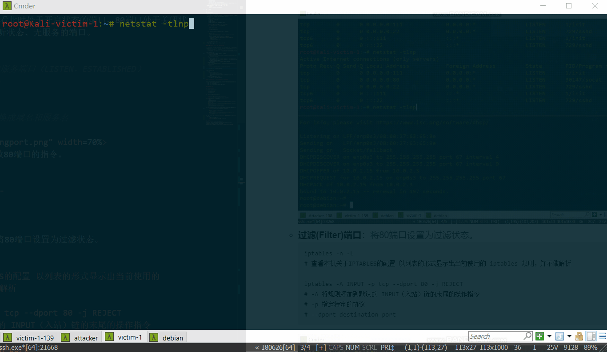
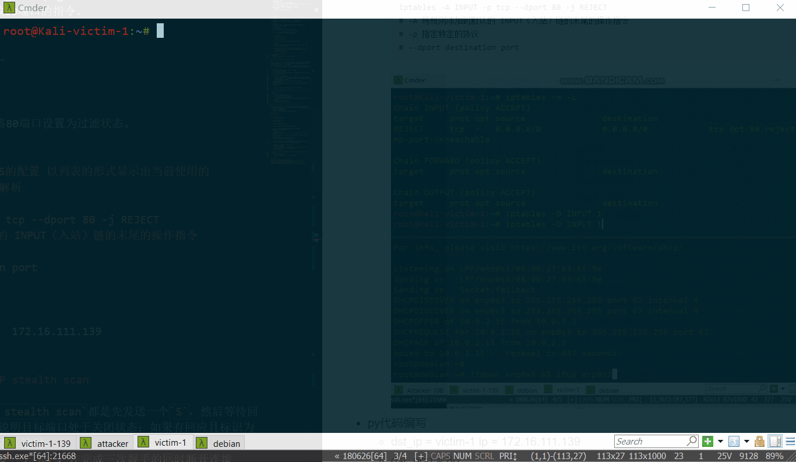
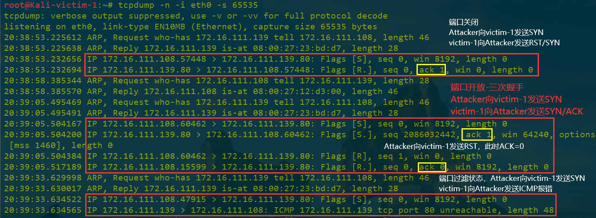
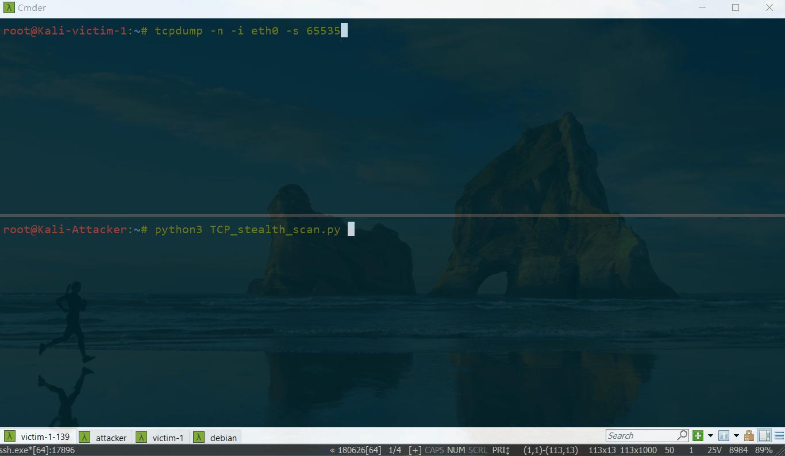

# 基于 Scapy 编写端口扫描器

## 实验目的

- 掌握网络扫描之端口状态探测的基本原理

## 实验环境

- python + scapy
- 网络拓朴的搭建
  - 一个网关`Debian10-GW`
    - 物理层的保证
        
        
    - 网卡配置原因
  
        | 网卡序号 | IP地址 | 理由 |
        | ------- | ------ | --- | 
        | 1 | 10.0.2.15 | (1)讨论`NAT和NAT Network在外网探测的显著区别` (2)保证外网连通性用NAT网络|
        | 2 | 192.168.134.4/24 | 主机远程控制|
        | 3，4 | 172.16.111.1/24，172.16.222.1/24|划分两个独立子网|

  - 一台靶机`Kali-victim-1` 
    - 主要需要内部网络，IP地址为172.16.111.139/24；
    - 第二张网卡为了方便主机远程控制。
        
        
  - 一台攻击者`Kali-Attacker`
    - 为了扫描实验的方便，和靶机在同一个内网，IP地址为172.16.111.108/24。
  - 拓扑图绘制
    
    
- 网络的连通性测试
  - 测试机器均能上网
  - 测试内网的连通信
    - 判断靶机和攻击者主机可以相互ping通
    - 打开虚拟机进行查看机器的IP地址，物理层保障，`ip addr show eth0`仅查看某个网卡的信息
        
        
- 待探测端口可以自行设置 开放、关闭 和 过滤 状态
  - 开放的模拟
    - 有没有进程、应用程序在该端口上

## 实验要求

- [x] 禁止探测互联网上的 IP ，严格遵守网络安全相关法律法规，不要在互联网上做扫描实验，只推荐在局域网
- 完成以下扫描技术的编程实现
  - [x] TCP connect scan / TCP stealth scan
  - [x] TCP Xmas scan / TCP fin scan / TCP null scan
  - [x] UDP scan
- [x] 上述每种扫描技术的实现测试均需要测试端口状态为：开放、关闭 和 过滤 状态时的程序执行结果
- [x] 提供每一次扫描测试的抓包结果并分析与课本中的扫描方法原理是否相符？如果不同，试分析原因；
- [x] 在实验报告中详细说明实验网络环境拓扑、被测试 IP 的端口状态是如何模拟的
- [ ] （可选）复刻 nmap 的上述扫描技术实现的命令行参数开关

## 实验过程

### TCP端口扫描

- 端口关闭、开放、过滤状态
  - **关闭(CLose)状态**：查看此时处于开启状态的端口，80端口处于关闭状态；或者随便选一个不处于监听状态、无服务的端口。
    ```bash
    netstat -tlnp
    # netstat -a 查看所有的服务端口（LISTEN，ESTABLISHED）
    # -t 表示tcp -u 表示udp
    # -l 表示监听
    # -p 表示程序名
    # -n 表示不将ip和端口转换成域名和服务名
    ```
    
    
  - **开放(Open)端口**：开放80端口的指令。 
      ```
      nc -l -p 80
      socat tcp-listen:80 -
      ```
      

  - **过滤(Filter)端口**：将80端口设置为过滤状态。
      `cannot be inferred from the response whether the port is open or closed.`
      ```
      iptables -n -L
      # 查看本机关于IPTABLES的配置 以列表的形式显示出当前使用的 iptables 规则，并不做解析
      
      iptables -A INPUT -p tcp --dport 80 -j REJECT
      # -A 将规则添加到默认的 INPUT（入站）链的末尾的操作指令
      # -p 指定特定的协议
      # --dport destination port
      ```
      
- py代码编写
  - 文档是`python 2.0`的语法，改成`python 3.0`；
  - `dst_ip = victim-1 ip =  172.16.111.139`；
  - `dst_port = 80`。

#### TCP connect scan / TCP stealth scan

- `TCP connect scan`与`TCP stealth scan`的区别在于当目标端口处于开放状态，有回应且标识为`SA`，此时
  - `TCP connect scan`会回复一个`RA`，在完成三次握手的同时断开连接
  - `TCP stealth scan`只回复一个`R`，不完成三次握手，直接取消建立连接
  - 在做实验时观察到，`TCP connect scan`回复的是`RST ACK=0`，而不是`RST ACK=1`。
- **TCP connect scan**
  - 在`victim-1`靶机设置监听eth0网卡开始抓包
    - eth0是victim的ip地址
    - 在`Kali-Attacker`攻击者虚拟机运行扫描文件TCP_connect_scan.py，停止抓包，存储在本地。
  - 课本
    - `Attacker`发送`SYN+PORT`
      - 端口开放状态：目标主机`victim-1`接收到一个`SYN/ACK`数据包；
      - 端口关闭状态：目标主机`victim-1`接收到一个`RST/ACK`数据包，端口关闭并且链接将会被重置；
      - 端口过滤状态：目标主机`victim-1`没有任何响应。
  - py代码编写问题：
    - 要加入`ICMP`的判断，端口处于过滤状态时，会发送ICMP包表示`Port unreachable`。
  - 扫描结果

      

      
- **TCP stealth scan**
  - 课本
    - `Attacker`发送`SYN+PORT`
      - 端口开放状态：返回`SYN+ACK`；
      - 端口关闭状态：返回`RST+ACK`；
      - 端口过滤状态：`no response`，或返回`ICMP ERROR(Type3,Code 1,2,3,9,10,13) `
  - 扫描结果

      

      

#### TCP Xmas scan / TCP fin scan / TCP null scan

- `TCP Xmas scan`、`TCP fin scan`及`TCP Null scan`不涉及三次交互。它们都是先发送一个包，然后根据目标主机是否回复`R`来目标端口的状态。
- **TCP Xmas scan / TCP fin scan / TCP null scan** 
  - 课本
    - `Attacker`发送`FPU:Flags(PSH,FIN,URG) + PORT / F:FLAG(FIN) + PORT / no FLAG(00000000 关闭所有 TCP 报文头标记) + PORT` 
      - 端口开放状态：`no response`；
      - 端口关闭状态：`RST`；
      - 端口过滤状态：`no response`，或返回`ICMP ERROR(Type3,Code 1,2,3,9,10,13)`
  - **TCP Xmas scan**
        
      

  - **TCP fin scan**
  
      

  - **TCP null scan**
  
      

### UDP端口扫描

- `UDP is a connection-less protocol`
- 课本
  - `Attacker`发送`UDP + PORT`
    - 端口开放状态：`no response / server responds to the client with a UDP packet`；
    - 端口关闭状态：`ICMP error type 3 and code 3`；
    - 端口过滤状态：`no response / ICMP error type 3 and code 1,2,3,9,10,13`。
- 扫描结果
    - 端口一直开启失败的解决方法
      ```
      nc -l -p 80
      改为  nc -u -l -p 80 < /etc/passwd &
      # 在OUTPUT上加一条规则
      ```
    - 没有观察到filtered的结果

      

      

## 实验问题与总结

1. 修改Kali的Hostname属性
    
    ```
    vi /etc/hostname
    vi /etc/hosts
    ```
2. `Debian`ssh无法输入密码连入

    

    

3. Kali的python是2.0，切换成3.0
    ```bash
    # 切换到python3.0
    update-alternatives --install /usr/bin/python python /usr/bin/python2 100
    update-alternatives --install /usr/bin/python python /usr/bin/python3 150
    # 换回 选择需要的python版本，输入序号
    update-alternatives --config python
    ```
4. 把port22的端口设置为filter，此时ssh失效，把防火墙的配置更改回来
      
      
      
      ```
      iptables -L INPUT --line-numbers
      # 查找所有的规则
      iptables -D INPUT 11 （注意，这个11是行号，是iptables -L INPUT --line-numbers 所打印出来的行号）
      # 删除一条规则
      ```
5. `gdk_cursor_new_for_display: assertion 'GDK_IS_DISPLAY (display)' failed`
      
      原因：远程登陆服务器
      
      

6. 有连接和无连接的区别
    >A connection-oriented protocol: a communication channel should be available between the client and server and only then is a further packet transfer made. If there is no communication channel between the client and the server, then no further communication takes place.
    
    >A Connection-less protocol: a packet transfer takes place without checking if there is a communication channel available between the client and the server. The data is just sent on to the destination, assuming that the destination is available.

## 参考资料

- [port scanning using scapy](https://resources.infosecinstitute.com/port-scanning-using-scapy/)
- [师哥作业](https://github.com/CUCCS/2018-NS-Public-TheMasterOfMagic/tree/ns-chap0x05/ns/chap0x05)

