# Web 应用漏洞攻防

## 实验目的

- 了解常见 Web 漏洞训练平台；
- 了解常见 Web 漏洞的基本原理；
- 掌握 OWASP Top 10 及常见 Web 高危漏洞的漏洞检测、漏洞利用和漏洞修复方法；

## 实验环境

- WebGoat
- Juice Shop
- kali主机
- docker

## 实验要求

- [x] 每个实验环境完成不少于**5**种不同漏洞类型的漏洞利用练习；
- [ ] （可选）使用不同于官方教程中的漏洞利用方法完成目标漏洞利用练习；
- [ ] （可选）**最大化**漏洞利用效果实验；
- [ ] （可选）编写**自动化**漏洞利用脚本完成指定的训练项目；
- [ ] （可选）定位缺陷代码；
- [ ] （可选）尝试从源代码层面修复漏洞。

## 实验过程

### WebGoat

概览
- [WebGoat的搭建](#webgoat%e7%9a%84%e6%90%ad%e5%bb%ba)
- [](#parameter-tampering-%e6%9c%aa%e9%aa%8c%e8%af%81%e7%9a%84%e7%94%a8%e6%88%b7%e8%be%93%e2%bc%8a)

#### WebGoat的搭建

- [Ubuntu 18.04搭建](https://github.com/c4pr1c3/ac-demo#ubuntu-1804-%E4%B8%8A%E9%85%8D%E7%BD%AE%E6%9C%AC%E9%A1%B9%E7%9B%AE)
- Kali搭建
  - 纯净环境的Kali虚拟机   
    ```bash
    docker ps
    # 证明无docker环境
    apt update && apt install docker-compose
    # 更新包管理器 和 安装docker-compose(docker官方当前使用的软件包名)
    apt policy docker.io
    # 查看docker镜像，显示Installed
    ```
  - [使用老师提供的代码](https://github.com/c4pr1c3/ctf-games)，配置环境。
    ```
    # 一次获取所有文件（包括所有子模块管理的文件）
    git clone https://github.com/c4pr1c3/ctf-games.git --recursive
    cd ctf-games
    # （可选）单独更新子模块
    git submodule init && git submodule update
    # 启动 webgoat 系列服务
    cd owasp/webgoat/ && docker-compose up -d
    ```
    图片证明，因为`docker-compose.yml`文件显示，对于`WebGoat-7.1`只能在输入`127.0.0.1:8087`下才能访问，把`127.0.0.1`删除后，可以监听任意ip地址下的该端口。同理`WebGoat-8.0`。
    
    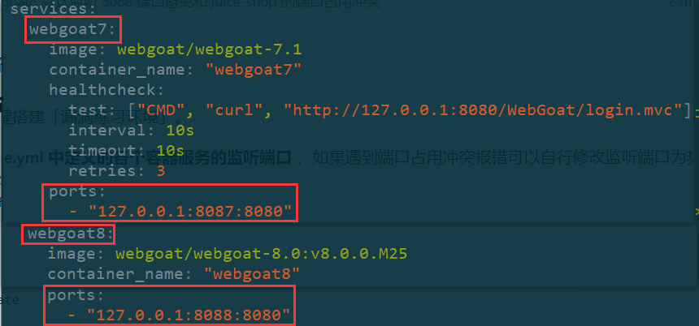
  - 启动环境后，查看webgoat7.1和8.0，都处于健康状态。

    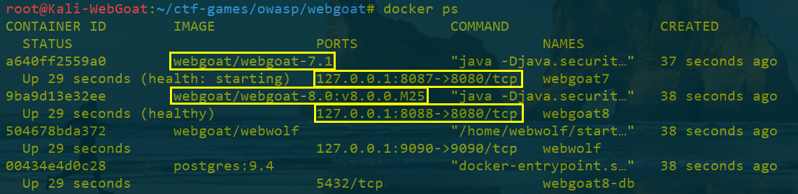
  - 打开`Kali-WebGoat`浏览器输入`ip地址/WebGoat/attack`或者`ip地址/WebGoat/login`进入登陆页面
    - WebGoat-7.1 以普通用户或者管理员身份登录 `127.0.0.1:8087/WebGoat/attack`

        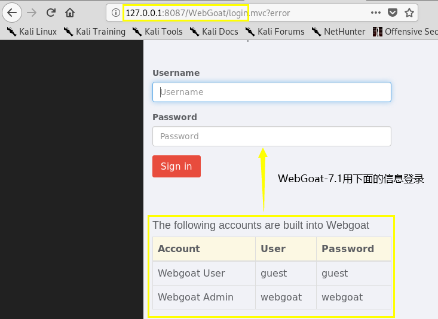
    - WebGoat-8.0 需要注册后再登录 `127.0.0.1:8088/WebGoat/attack`
        
        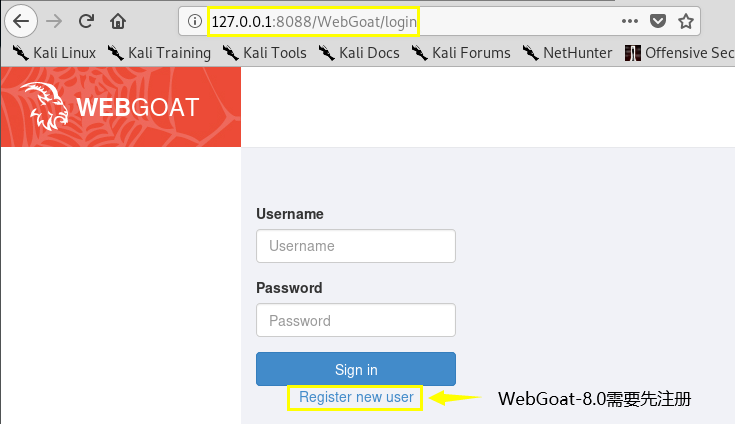
- `Burp Suite`使用基础
  - 正向代理工具，浏览器配合使用`Burp Suite`
  - 在`firefox add-ons`装扩展`Proxy SwitchyOmega`，不用每次更改系统配置
        
    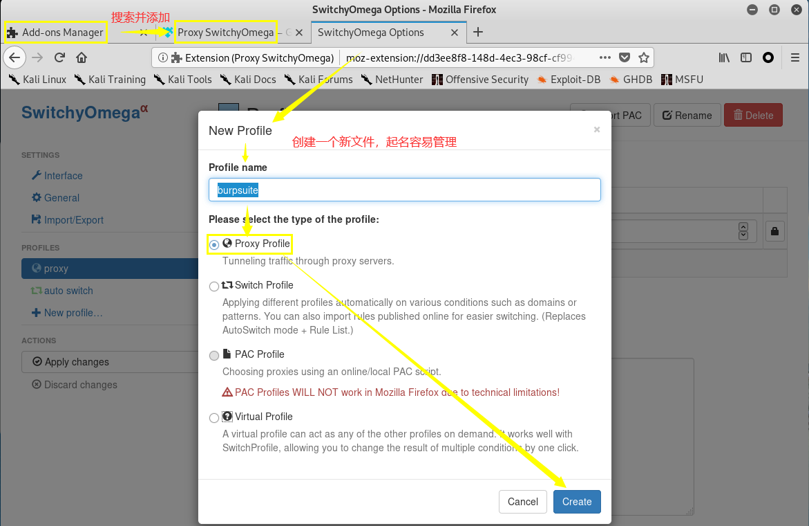

    - `Burp Suite`的相关配置信息
        
        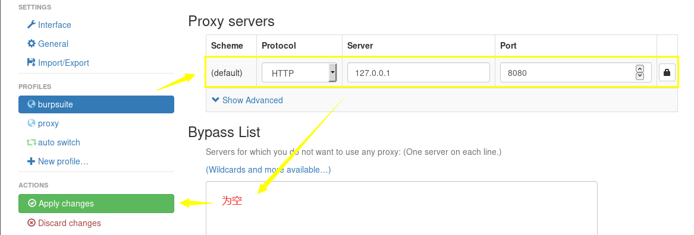
    - `Burp Suite`的设置

        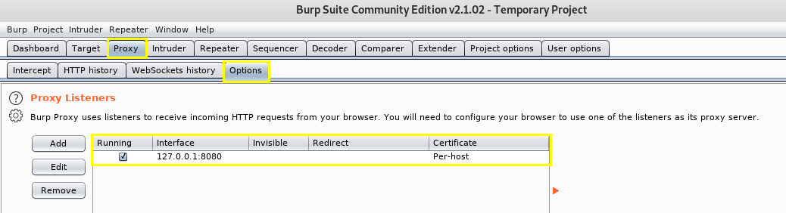
  - 手动更改Firefox的Connection Settings 
    - HTTP Proxy 127.0.0.1 Port:8080(Burp Suite默认)
    - No Proxy for  去掉 `localhost,127.0.0.1`
  - `Proxy`设置`intercept is off`，`Burp Suite`能够拦截通过的数据包
  - `Proxy`设置`intercept is on`，burpsuite会拦截所有的请求(相当于网络请求的断点模式)，随便更改`Raw packets`，再`forward`。
  - 一个使用实例
    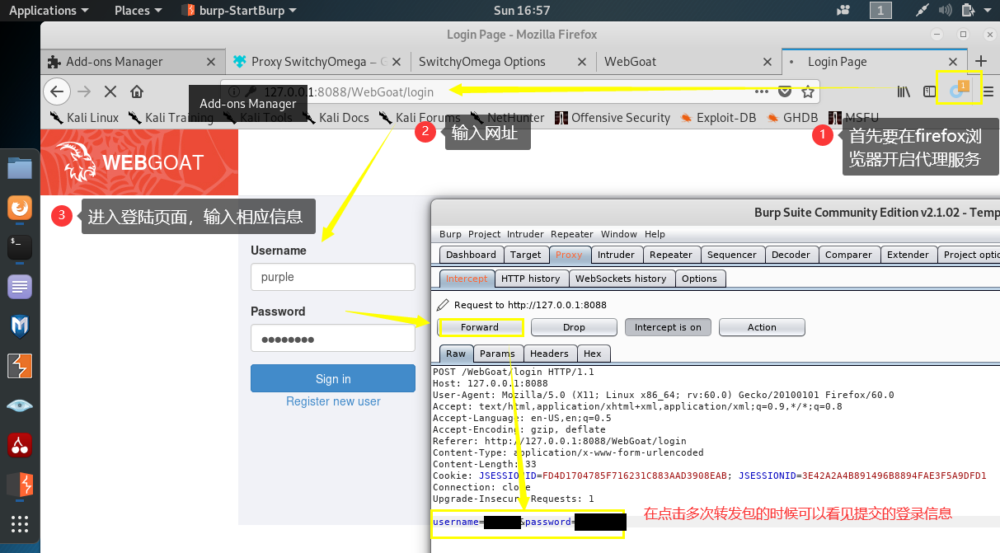

#### Parameter Tampering (未验证的用户输⼊)

- 攻击者对HTTP请求进行修改
  - 修改`URL/请求字符串/HTTP 请求头/Cookies/表单域/隐藏域`
- 漏洞利用
  - 获得对客户端缓存、Cookie、请求编码等的控制/强制浏览/命令执行/Cookie 毒化和隐藏域控制
  - 篡改工具：`Burp Suite`
- 原因：
  - 只在客户端进行了输入验证
  - 输入数据过滤时未进行规范化，导致过滤措施被绕过
- 安全加固方法
  - 所有的用户输入需要在服务端进行集中的统一验证
  - 不“滥用”隐藏域，重要数据应存储在 Session 中或对请求参数进行签名验证。
  - 对于请求参数需要严格验证其类型
  
##### Bypass front-end restrictions 「WebGoat-8.0」

- 绕过前端的限制
  - 前端：浏览器
  - 后端：用户端
- 突破限制
  - Test One：直接在`Burp Suite`的界面进行修改后，转发包，成功。
    证明前端页面的下拉框、单选框、多选框和文本框的限制**无用**。
        
    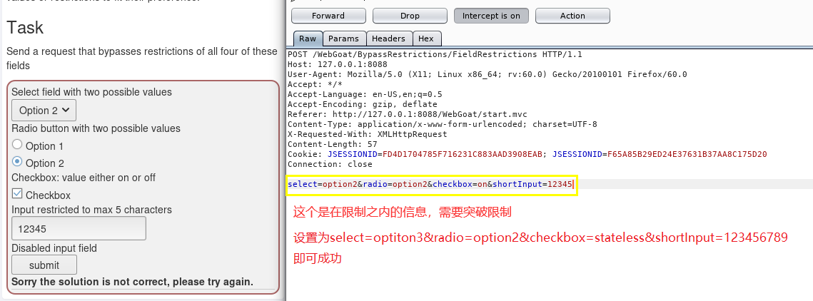
  - Test Two[待解决]
    >there is some mechanism in place to prevent users from sending altered field values to server, such as validation before sending 用发送前验证防止修改字段
    >绕过方法：重放攻击

    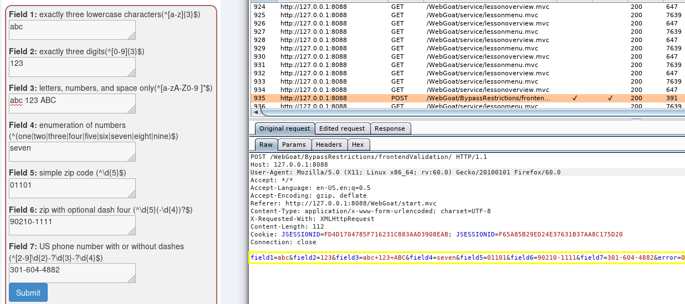

##### Bypass HTML Field Restrictions 「WebGoat-7.1」

- 绕过HTML字段的限制

##### Exploit Hidden Fields 「WebGoat-7.1」

- 利用隐藏字段

#### Injection Flaws (注⼊缺陷)

##### Command Injection (命令注入攻击) 「WebGoat-7.1」

- 攻击`parameter-driven sites`，将用户输入未经过滤或者过滤不严就直接当作系统命令进行执行。
- 命令连接符号
  - && 前一个指令执行成功，后面的指令才继续执行，就像进行与操作一样
  - || 前一个命令执行失败，后面的才继续执行，类似于或操作
  - & 直接连接多个命令
  - | 管道符，将前一个命令的输出作为下一个命令的输入
  - ; 直接连接多个命令
- 解决方法
  > sanitize(清理) all input data, especially data that will used in OS command, scripts, and database queries 
- 实验过程
  "&& echo "hello world
  
  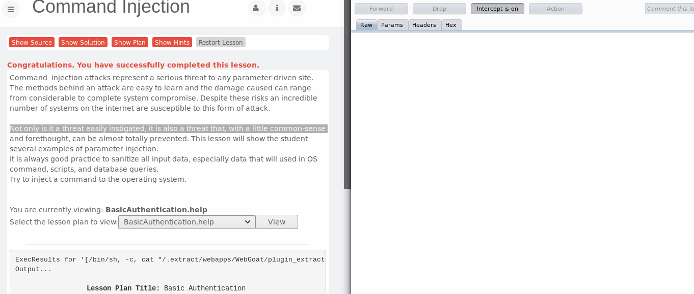

##### SQL Injection 「WebGoat-7.1」

##### SQL Injection 「WebGoat-8.0」

#### Cross-Site Scripting

##### Phishing with XSS 「WebGoat-7.1」

- 漏洞利用
  > Insert html to that requests credentials 请求凭据
  > Add javascript to actually collect the credentials
  > Post the credentials to http://localhost:8080/WebGoat/catcher?PROPERTY=yes...
- 实验过程[莫名其妙的过了]
  <script>alert('hacked')</script> 

##### Stored XSS Attacks 「WebGoat-7.1」

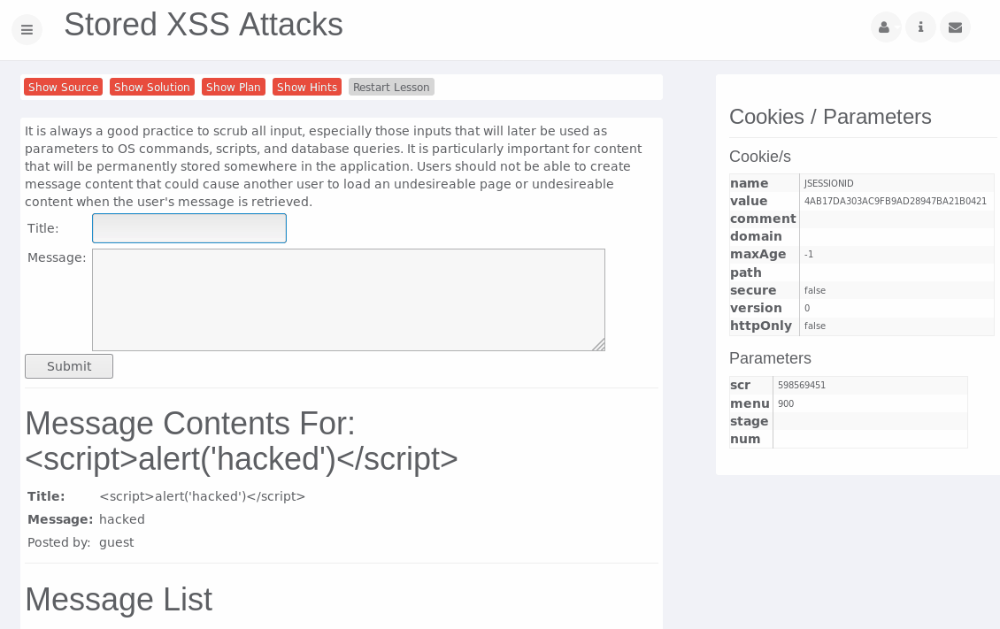

##### Stored XSS Attacks (跨站点脚本XSS) 「WebGoat-8.0」

##### Cross Site Request Forgery (CSRF) (跨站点请求伪造) 「WebGoat-8.0」

- `One Click Attack` 或者 `Session Riding` 

#### Authentication Flows (认证缺陷)

##### Session Management Flaws (脆弱的访问控制) 「WebGoat-7.1」

- Password Strength [看了solution，还涉及到计算知识]
- Forget Password
  - 某些网站用于找回密码的认证问题过于简单，可以通过暴力求解
    
    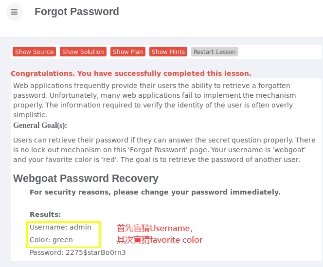

#### Malicious Execution (恶意执行)

##### Malicious File Execution (⽂件上传漏洞) 「WebGoat-7.1」

```
<HTML>

<% java.io.File file= newjava.io.File("/.extract/webapps/WebGoat/mfe_target/guest.txt");file.createNewFile();%>

</HTML>
```
- 实验过程
  - 先上传图片
  - 后上传`.jsp`，虽然是`.jsp`文件，但是浏览器的预览功能还是会识别成图片，所以可以右键`view image info`和`copy image location`。
  - 一旦`copy image location`后，将代码放入网址栏？？？，就可以成功执行

    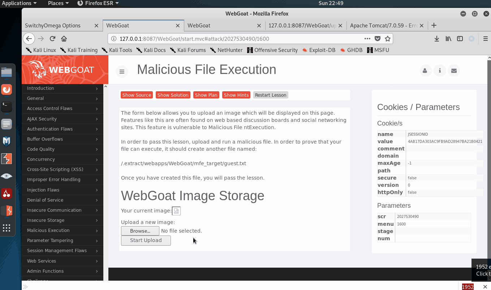

### Juice Shop

## 实验问题解决与总结

1. `docker-compose up -d`后报错
   ```
   ERROR: Couldn't connect to Docker daemon at http+docker://localhost - is it running?
   If it's at a non-standard location, specify the URL with the DOCKER_HOST environment variable.
   
   service docker status 
   # 查看docker是否运行，状态为Active: inactive (dead)

   systemctl start docker
   # 启动

   systemctl stop docker
   # 关闭
   ```

## 参考资料