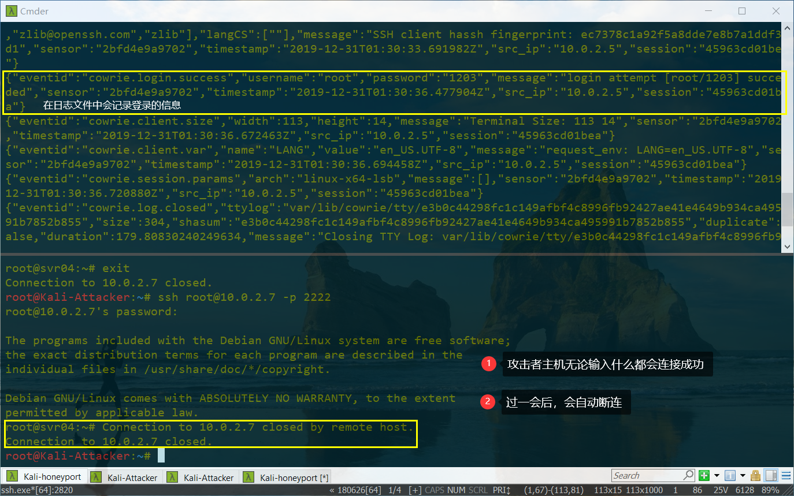

# 常见蜜罐体验和探索

## 实验目的

- 了解蜜罐的分类和基本原理
- 了解不同类型蜜罐的适用场合
- 掌握常见蜜罐的搭建和使用

## 实验环境

- 从`paralax/awesome-honeypots`中选择**1**种低交互蜜罐和**1**种中等交互蜜罐进行搭建实验 (**推荐 SSH 蜜罐**)
- 网络拓朴结构
- 一台`victim`和一台`attacker`，均使用`NAT Network`
        
        

## 实验要求

- [x] 记录蜜罐的详细搭建过程；
- [x] 使用`nmap`扫描搭建好的蜜罐并分析扫描结果，同时分析「 nmap 扫描期间」蜜罐上记录得到的信息；
- [x] 如何辨别当前目标是一个「蜜罐」？以自己搭建的蜜罐为例进行说明；
- [ ] （可选）总结常见的蜜罐识别和检测方法；
- [ ] （可选）基于 canarytokens 搭建蜜信实验环境进行自由探索型实验

## 实验过程

### 低交互蜜罐 「 twisted-honeypots 」

#### 蜜罐搭建

在`Kali-victim`下
- `Kali`默认是`python 2`，由于该蜜罐是由`python 3`编写的，所以切换成`python 3`。
    ```bash
    python --version
    # 查看python版本
    update-alternatives --install /usr/bin/python python /usr/bin/python2 1
    update-alternatives --install /usr/bin/python python /usr/bin/python3 2
    # 最后的数字1，2代表优先级
    ```
- 安装蜜罐
    ```bash
    pip3 install service_identity 
    # 安装依赖
    git clone https://github.com/lanjelot/twisted-honeypots /opt/twisted-honeypots
    cd /opt/twisted-honeypots
    service mysql start
    sudo ./install.sh && ./setup-db.sh
    ```
- 运行蜜罐
    ```bash
    sudo ./start.sh
    sudo ./stop.sh
    # start & stop
    ```
- 查攻击者的行为
    ```bash
    ./monitor.sh
    # monitor the current execution
    ```
    靶机对于这些尝试连接均有记录，统计了各IP地址、用户名、密码的出现次数

    

  
#### 蜜罐测试

- [ 未解决 ]登陆测试，ssh登陆不上。
    ```bash
    ssh root@10.0.2.7
    # 需要输入密码
    ssh -c aes128-cbc root@10.0.2.7
    # -c cipher_spec
    tail -F /var/log/twistd-pot.log
    # 查看日志文件 报错信息为
    couldn't handle 
    2019-12-31T15:20:06+0800 [PotSSHServerTransport,14,10.0.2.5] '\x00\x00\x00A\x04\xc2\xc7\x0f\xd4\x11>\xef\xb9`\x83\x1f\xf2b\x8a\xc4v\x04\xf6\xc6\x14\x84\x91\x0bn1:e1\xbe\x05\xc4\xf1\xd3\xf7\xc7\xe68\x17\xa9//\x83\n}\xa9?\xe561X\xeb\xdbR\xc1\xa6\xdc\xd2%rf"\x03m\x88'
    ```
    

#### 使用`nmap`扫描搭建好的蜜罐并分析扫描结果
- 尝试`TCP connect scan、TCP stealth scan、XMAS scan、FIN scan、NULL scan`，只有当`TCP connect scan`的时候日志记录

    ```bash
    nmap -sT -P 22 -T4 -n -vv 10.0.2.5
    -sS TCP SYN scan
    -sT TCP connect scan
    -sX -sF -sN TCP Xmas, FIN, NULL scans
    -T<0-5>: Set timing template (higher is faster)
    -n/-R: Never do DNS resolution/Always resolve [default: sometimes]
    -v: Increase verbosity level (use -vv or more for greater effect)
    ```

    

### 中等交互蜜罐 「 Cowrie SSH Honeypot 」

#### 蜜罐搭建

- 从[paralax/awesome-honeypots](https://github.com/paralax/awesome-honeypots)中选择中等交互蜜罐`cowrie ssh honeypot`
- [在docker下的环境搭建文档](https://github.com/cowrie/cowrie#docker)
- 安装 cowrie
    ```bash
    # 这个方法真的很难装
    # 在Kali-victim下，确保已经安装了docker
    apt update && apt install docker-compose  
    # 安装docker
    git clone https://github.com/cowrie/docker-cowrie.git
    cd docker-cowrie/
    make all  
    # build all the images 
    docker-compose up -d
    # 运行cowrie
    ```

    ```bash
    # 考虑另外一个方法，在gitclone后
    cd docker-cowrie/   
    docker pull cowrie/cowrie
    docker run -p 2222:2222 cowrie/cowrie
    # 运行cowrie    
    ``` 
    

    

#### 测试蜜罐
- 在运行`cowrie`后，攻击者主机尝试连接靶机，以`root`用户的身份无论密码输入什么内容都可以成功登陆(除root以外的不行)，同时在靶机的日志文件中可以看到攻击者主机的操作，登陆时输入的密码什么的都可以被记录下来。
  ```
  # 攻击者连接靶机
  docker exec -it <docker name> tail -F /cowrie/cowrie-git/var/log/cowrie/cowrie.json
  # 靶机查看日志文件
  # 由docker ps 查看<docker name> 一定是要运行了cowrie才可以查看
  ```
  
- 暴露一：一段时间后蜜罐会自行断连。但日志信息中会记录`"message":"Connection lost after 181 seconds"`，每次断连后，都会显示此消息。
      
  
- 暴露二：ping操作
  - `ping www.baidu.com`的IP地址和宿主机上的IP地址不同
  - 响应时间相同，原则上每次ping应该为随机

      

- 暴露三：成功连接后，攻击者主机输入命令`curl www.baidu.com`，当`curl 要访问的网址`应该获得页面源代码，此处报错。
      
  

  试试其他命令，例如无法保存文件源代码，无法识别查看访问页面的命令。
  

- 暴露四：wget(非交互式的网络文件下载工具)
  - 无帮助文档
  - 能够正常下载文件
  - 退出，再次连接靶机后，无刚才下载的文件
  

#### 使用`nmap`扫描搭建好的蜜罐并分析扫描结果
- TCP connect scan、TCP stealth scan、XMAS scan、FIN scan、NULL scan，只有`TCP connect scan`的时候发现蜜罐记录的日志文件，在扫描的时候不仅有22端口，还有2222端口（暴露的可能性）
    
    

## 实验问题与解决

1. [ 低交互蜜罐的功能低下，所以很难搭建 ] 低交互蜜罐 「 SSH Honeypot 」 一直搭建不起
- 蜜罐搭建
    在`Kali-victim`下
    - 从[paralax/awesome-honeypots](https://github.com/paralax/awesome-honeypots)中选择低交互蜜罐ssh-honeypot
    - 将参考资料的仓库克隆到本地
    - [ 存疑 ] 宿主机到虚拟机的`ssh`服务的现在端口为22，而蜜罐的端口默认为22，所以修改虚拟机的`ssh`的配置文件`vi /etc/ssh/sshd_config`的端口为其他不冲突端口23，`service ssh restart`重启ssh服务`。
            
        
    - 安装docker并启动

            ```bash
            apt update && apt-get install docker docker-compose
            # 更新包管理器并且安装docker
            service docker start
            systemctl start docker
            # 启动docker
            ```
    - 搭建蜜罐  
        进入`ssh-honeyport`文件夹中
        ```bash
        apt install libssh-dev libjson-c-dev
        # Make sure libssh and libjson-c are installed
        make
        ssh-keygen -t rsa -f ./ssh-honeypot.rsa
        bin/ssh-honeypot -r ./ssh-honeypot.rsa
        # Build and Run
        bin/ssh-honeypot -h
        # Usage
        ```
        
        
- 蜜罐测试
  - 攻击者尝试连靶机，这个蜜罐算是搭建失败

      
2. 启动`twisted-honeypots`出问题
    

   - [ 错误思路 ] 以为是蜜罐端口和ssh端口冲突
      - 尝试`netstat -tlnp`查看，用`kill -9 <PID>`方式去掉，无效
      - 修改ssh的配置文件
           ```bash
           vi /etc/ssh/sshd_config
           # 将 port 22 的注释去掉 修改为其他端口
           ```
   - 禁用ssh服务 `service ssh stop`，于是启动成功。
3. 靶机的eth0网卡的ipv4地址会突然消失，用`ifconfig eth0 10.0.2.7/24`添加。
  
## 总结常见的蜜罐识别和检测方法

### 低交互性蜜罐的识别

- 使用复杂命令测试，和真实环境不同
- 通过网络数据包的分析，如ICMP包的不同
- 通过扫描判断蜜罐提供的功能，低交互蜜罐只负责模拟并记录攻击者尝试进行登录的用户名和密码
- 通常不能够完全真实模拟物理机器应有的配置
  
## 参考资料

- [jdltxdy](https://github.com/CUCCS/2019-NS-Public-YanhuiJessica/tree/ns0x11/ns-0x11)