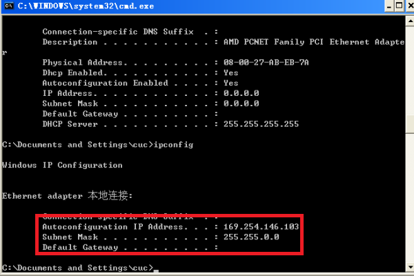

# 基于 VirtualBox 的网络攻防基础环境搭建

## 实验目的

* 掌握VirtualBox虚拟机的安装与使用
* 掌握VirtualBox的虚拟网络类型和按需配置
* 掌握VirtualBox的虚拟硬盘多重加载

## 实验环境

以下是本次试验需要使用的网络节点说明和主要软件举例：

* VirtualBox虚拟机6.0
* 攻击者主机（Attacker）：Kali Rolling 64-Bit 2019.3
* 网关（Gateway，GW）：Debian Buster（老师提供的压缩包）
* 靶机（Victiom）： xp-sp3（老师提供的压缩包）

## 实验要求

### 1. 虚拟硬盘配置成多重加载

#### 		1.1 将虚拟硬盘由普通设置为多重加载

- 首先正常的虚拟硬盘是普通，配置成多重加载的好处：可以将虚拟镜像文件和加载点文件复制到其他电脑里面直接创建一个虚拟机，而不用再次装系统。

- 关闭虚拟机，打开虚拟介质管理，直接将对应的vdi改为多重加载后报错，原因是该虚拟硬盘仍然连接着一个虚拟机，还未释放虚拟硬盘。

  

- 右键vdi选择释放，由于我之前给我的虚拟机进行了备份，不能直接释放vdi，而要从第一个备份开始往后一个个释放备份。

- 释放完毕后，右键vdi的属性，将类型修改为多重加载，选择应用。

  

* 将老师给的vdi设置为多重加载出错，我初步猜测是因为我将该vdi注册后，还未分配给某个虚拟机，而直接想修改为多重加载，所以报错。正确操作应先把它添加为一个虚拟机的虚拟硬盘，然后再释放，而后再改为多重加载。

#### 		1.2 复用多重加载的虚拟硬盘

* 将虚拟机原有的虚拟硬盘，改成多重加载的硬盘。右键虚拟机->设置->存储->控制器:SATA，添加虚拟硬盘到控制器->使用现有的虚拟盘，选择我们刚才设置好的多重加载的虚拟硬盘。

* 新建一个虚拟机时，选择使用已有的虚拟硬盘文件，即设置过多重加载的vdi。

  

* 对没有盘片的疑惑：此处的控制器IDE有盘片，则每次开启虚拟机系统则会重新安装一遍系统，没有盘片相当于系统安装完毕后，光盘自动弹出的过程。

### 2.搭建满足如下拓扑图所示的虚拟机网络拓扑

* 解释虚拟网络拓扑图：首先图示有三个网络，分别是内部网络intnet1和intnet2以及Nat网络，内部网络intnet1和intnet2分别有两个victim主机，Gateway和Attacker在Nat网络中。内部网络和Nat网络的通信传输通过网关Gateway作为跳板。图示的云朵应该是表示Nat网络。

* 由于电脑性能带不起，启动一个电脑主机都快得卡死，所以选择了如下的虚拟网络拓扑，而且将每个的虚拟内存设为512MB（若是1024MB，则启动的时候会报错电脑主机可用的内存不足）。

  

### 3. 网卡及网络配置

依据是VirtualBox的基础设施保障，在设置虚拟机网络的时候，将网卡的连接方式和网络的界面名称设置为相同的，则可视为这些虚拟机在同一个局域网中。

#### 3.1 靶机（Victim）

* 靶机1：一块网卡，设置为内部网络（internal）模式，名称为‘intnet1’。

  

* 靶机1的默认网关为Debian-Gateway。

  

* 靶机2：一块网卡，设置为内部网络（internal）模式，名称为‘intnet2’。

  

* 同理靶机2的默认网关为Debian-Gateway。

  

* Default Gateway、DHCP Server和DNS Servers都是Debian-Gateway，证明Debian-Gateway不仅是两个不同内部网络的连接在一起的网关，而且这个网关提供DHCP(给接入的客户机自动分配IP地址和子网掩码)服务和DNS(域名解析)服务。

 
#### 3.2 网关（Gateway）

* 四个网卡，`严格按照此顺序`，分别设置为NAT网络、host-only网络、内部网络intnet1和内部网络intnet2。

  

* 在虚拟机全局设置，网络中NAT网络的设置如下。

  

* 四个网卡设置的原因：老师提供的Debian已经配好了防火墙以及网卡。如果不严格按照该顺序，则可能会出现看不到IPv4地址的情况。
  
  

#### 3.3 攻击者（Attacker）

* 一个网卡，设置为和网关相同的NAT网络。

  

#### 3.4 各个节点的地址显示
* 靶机
  
| id | IP地址 | 子网掩码 | 默认网关 |
| :--- | :---| :---| :--- |
|Debian-Gateway网卡3|172.16.111.1/24|255.255.255.0|172.16.111.1/24|
|Debian-Gateway网卡4|172.16.222.1/24|255.255.255.0|172.16.222.1/24|
|Xp-Victim1|172.16.111.133/24|255.255.255.0|172.16.111.1/24|
|Xp-Victim2|172.16.222.139/24|255.255.255.0|172.16.222.1/24|
* 攻击者主机和网关
  
| id | IP地址 | 子网掩码 | 默认网关 |
| :--- | :---| :---| :--- |
|Debian-Gateway网卡1|10.0.2.15/24|255.255.255.0|10.0.2.0/24|
|Kali-Attacker网卡1|10.0.2.4/24|255.255.255.0|10.0.2.0/24|

### 4. 完成以下网络连通性测试

#### 4.1 靶机之间的连通性

* 两个不同内部网络的靶机不可以相互访问。
  
  

* 实验分析：用命令`vim /etc/network/interfaces`查看网关的网络接口，因为两个不同的网段的数据包的传送需要路由器配置相应的端口转发。网关中配置了对于网卡enp0s9在转发(FORWARD)数据包时，源地址为172.16.111.0/24网段内(即内部网络1)的机器发送给目的地址为172.16.222.0/24网段内(即内部网络2)的机器的数据包都会被丢弃(DROP)，而不发送任何回应。所以处于内部网络1的靶机victim1无法访问内部网络2的机器。同理处于内部网络2的靶机victim2无法访问内部网络1中的机器。假设配置的不是DROP而是ACCEPT，我觉得应该两个内部网络是可以通信的。
  
  

#### 4.1 靶机可以直接访问攻击者主机

* 验证网络层的连通性，通过靶机ping攻击者主机实现。Kali-Attacker的ipv4地址为10.0.2.4，两个靶机都可以ping通攻击者主机。

  

* 实验分析：靶机和攻击者主机在网络层可连通的原因是靶机通过网关连接到互联网，攻击者主机通过配置NAT网络也连接到了互联网，故靶机可以访问攻击者主机。在网关的配置中对于enp0s9网卡配置了在转发(FORWARD)数据包时，源地址为172.16.111.0/24网段内的机器发送给目的地址除172.16.111.0/24外的网段内的机器的数据包都会被接收转发(ACCEPT)，所以处于内部网络的靶机可以访问外网以及攻击者主机。同理处于内部网络2的靶机。

  
  

#### 4.2 攻击者主机无法直接访问靶机

* 网络层的不连通性：通过ping命令，判断攻击者主机和两个靶机在网络层具有不连通性。

  

* 链路层的不连通性：通过arp表，判断攻击者主机和两个靶机不在同一个局域网中。

  * 两个靶机的arp表中只有网关的mac地址。

    

    

  * 攻击者主机的arp表中有网关的mac地址，而没有两个靶机的地址。
  
    
  
  
  * 附加查看网关的arp表，发现有攻击者主机的mac地址和两个靶机的mac地址。
  
    
  
    
  
        
  
  * 上述证明，两个靶机不在同一个局域网中，所以他们在链路层和网络层上是无法通信的。两个靶机分别和网关在同一个局域网中，他们都和攻击者主机不在同一个局域网中。攻击者主机和网关在同一个局域网中。
  
  * 在网关网络接口的配置中可以得到进一步的证实，其实和两个内部网络不互通是同一个道理，因为网关没有配置相应的端口转发。攻击者主机和网关同属于一个NAT网络，NAT网络中的数据包要发送的内网需要Debian网关的enp0s3配置端口转发。
  * VirtualBox的NAT网络模式的网卡本质上就是一个普通的网卡，只不过所在子网提供NAT服务而已。对于网关和攻击者这两个主机来说，VirtualBox的宿主机就是他们的网关，NAT服务由宿主机提供。当他们两个有联网操作时才会用到NAT服务。而这个NAT和网关自己对内的NAT一点关系都没有，对于攻击者来说两个子网里的靶机就是不可达的，但是网关配置了端口转发数据包就可达了。

  

  

#### 4.3 网关可以直接访问攻击者主机和靶机

* 检验Debian-Gateway可以在网络层访问Kali-Attacker，通过ping命令。

  

* 检验Debian-Gateway可以直接访问两个victim，也通过ping命令。

  

* 实验分析：
  * 网关可以直接访问攻击者主机是因为两者处于同一NAT网络。
  * 网关可以直接访问靶机的原因：因为网关和靶机1处于同一个内部网络1，和靶机2处于同一个内部网络2。仍可以通过网关的网络接口配置的分析得出，语句`iptables -I FORWARD -s '172.16.111.0/24' -d '172.16.111.0/24' -i enp0s9 -j ACCEPT`直译是在FORWARD链上添加(-I)一条规则（链上的规则在数据包进入该链后触发），规则内容是：当源地址(-s)与目标地址(-d)都在172.16.111.0/24这个子网内，且是由enp0s9这个网卡(-i指定网卡)接受到该包的话，那么认为该包通过FORWARD的链的过滤，可以送入(-j)POSTROUTING链了，即可以发送。通俗来讲即告诉网关子网里主机间的通信应该转发，所以我们才可以得出内部网络间的机器可以相互通信。
  
  
#### 4.4 靶机的所有对外上下行流量必须经过网关

* 通过靶机ping网关，同时网关开始抓包，过滤只剩下icmp的包，发现icmp包中的request包中源地址是靶机的IP地址，目的地址是网关的IP地址，reply包的源地址是网关的IP地址，目的地址是靶机的IP地址。

  

  

* 当关闭网关时，发现靶机无法访问外网，则证明靶机的所有对外上下行流量必须经过网关。
  
  

* 通过语句`iptables -P FORWARD DROP`，知道网关配置了丢弃所有待转发的包。网关转发时能连通，不转发不能连通，能够证明靶机的所有对外上下行流量必须是经过网关的。
  
#### 4.5 所有节点均可以访问互联网

* 将4个虚拟机电脑ping百度的网址，都可以ping通。

  

* 实验分析：两个靶机在两个不同的内部网络分别通过网关访问外部网络，网关和攻击者主机处于同一个NAT网络，NAT网络可以访问外部网络。
  

## 实验总结

### 1. 问题与解决
可能是我的基础知识不扎实，所以出现了一些问题，在此做出说明。

* 虚拟机进行了备份后不能直接释放vdi，要先一个个释放备份。 

* Kali-attack之前一直默认的是连接第二块网卡，所以用ifconfig等命令一直得不到第一块网卡的IP地址。处理：右键kali，进入settings的network，将eth0设置为connected。

  

* 当网关未打开时，在靶机中执行ipconfig等命令，会发现无默认网关，而且IP地址为0.0.0.0，而后就会得到一个Autoconfiguration IP Address，即自动分配的IP地址。

  

* 靶机的防火墙，即xp的防火墙默认是开启的，在做这个实验的时候注意要关闭，否则我出现了无法由网关ping通靶机的情况。

### 2. 知识总结

* virtualbox中四种网络的意思：
  
  * 内部网络(Internal)中，同一个内部网络的虚拟机可以相互访问，但是内部网络的虚拟机和宿主机之间无法双向访问。 
  
  

* iptables的规则表，用于分析网关的network interfaces。

  

* DNAT（Destination Network Address Translation,目的地址转换)通常被叫做目的映射，SNAT（Source Network Address Translation，源地址转换）通常被叫做源映射。
  * 由语句`iptables -t nat -A(append) POSTROUTING -s '172.16.222.0/24' ! -d '172.16.222.0/24' -o -enp0s3 -j MASQUERADE`，`-j MASQUERADE`的含义是去动态SNAT。不管现在enp0s3的出口获得了怎样的动态ip，MASQUERADE会自动读取enp0s3现在的ip地址然后做SNAT出去，实现了动态SNAT地址转换。
  * 即内部网络和外部的通信中，内部网络的IP地址会被网关封装成自己enp0s3网卡的IP地址，NAT的原理是把内部IP映射成外部IP+端口，通过将内部网络IP地址(私网IP)替换为出口的IP地址提供公网可达性和上层协议的连接能力，所以从内部网络发数据包给外网时，通过网关将该数据包的IP地址换为填入网关的IP地址，所以叫源地址转换。
  * 只和靶机的连通性有关。

## 参考资料

* [师姐的作业](https://github.com/CUCCS/2018-NS-Public-jckling/blob/master/ns-0x01/基于VirtualBox的网络攻防基础环境搭建.md)

* [参考同学的作业-关于靶机的所有对外上下行流量必须经过网关的验证](https://github.com/CUCCS/2019-NS-Public-Liuxxx3/blob/4fc8bb0ef0af6e1f6874e2df3c711e5f647b400a/%E5%9F%BA%E4%BA%8E%20VirtualBox%20%E7%9A%84%E7%BD%91%E7%BB%9C%E6%94%BB%E9%98%B2%E5%9F%BA%E7%A1%80%E7%8E%AF%E5%A2%83%E6%90%AD%E5%BB%BA.md) 

* [virtualbox的network mode](http://download.virtualbox.org/virtualbox/UserManual.pdf)
  
* [iptables的参数讲解](cnblogs.com/kevingrace/p/6265113.html)
* [理解iptables中DNAT、SNAT和MASQUERADE](jianshu.com/p/beeb6094bcc9)

