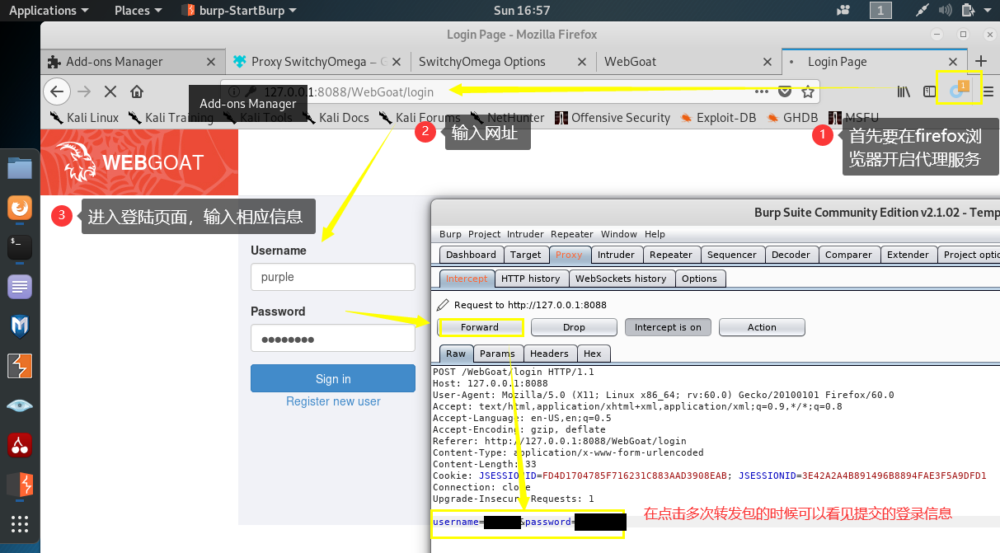

- 视频观看
  - 
  - [x] 本章实验内容所需实验环境搭建基本方法 (26:00)
  - [ ] WebGoat 容器实验环境搭建基本方法 (08:12)
  - [ ] 其他常见 Web 漏洞复现训练环境 (26:04)
  - [ ] 以 shellshock 为例展示如何基于真实漏洞复现环境来进行漏洞原理学习 (13:43)
  - [ ] WebGoat 容器实验环境和 PHP 缺陷代码调试环境搭建基本方法

- WebGoat 
  - 应用层 移动端 Web应用
  - 在内网搭建一个存在缺陷的系统 -> `攻防的靶场环境`
  - webgoat docker
- docker 国内镜像仓库...

## 靶机环境中装docker
- 要求
  - 确保漏洞环境装在靶机环境
  - 可以和另外一个虚拟机在同一个网段
  - 也可以在宿主机同一个网段
  - 做实验的过程中断开外网连接，减少攻击面
- 最终效果
  - docker ps -a？ 实例化的两个容器
  - 容器：
    - 多重加载模式创建出来的虚拟机 -> 容器环境
  - docker images
    - 镜像 -> 虚拟机虚拟介质管理的基础镜像
    - 容器 从 同一个镜像 中 派生很多容器
  - 获得训练环境
    - docker start 复制容器的名字
    - 访问虚拟机的8080端口 就是 访问 容器的
      - ip:8080/WebGoat/login
      - 8.0版本 多了注册功能
      - 漏洞教程[左边]
      - docker权限隔离：保护虚拟机，虚拟机的机制保护宿主机(虚拟机逃逸漏洞价格)
- 根据当前版本查询安装
- docker加速【遇到特殊环境，未遇到按照官方文档】

## 安装WebGoat
- 老师的仓库
- [WebGoat docker安装WebGoat8的官方文档](https://hub.docker.com/r/webgoat/webgoat-8.0/)
  ```bash
  docker pull webgoat/webgoat-8.0 d
  # 只下载不执行
  ocker run -p 8080:8080 -t webgoat/webgoat-8.0
  # 下载执行 现在本地的镜像仓库找 找不到再pull
  # 宿主机上的8080端口 映射到 容器 环境的8080端口
  # -t 获得交互式终端 
  # 下载镜像的名字 webgoat/webgoat-8.0

  docker pull webgoat/webgoat-7.1 
  docker run -p 8080:8080 -t webgoat/webgoat-7.1
  ```
- [WebGoat docker安装WebGoat7的官方文档](https://hub.docker.com/r/webgoat/webgoat-7.1/)

## 未验证的用户输入

- ViewServlet 浏览器图片预览功能
- 加载正常访问无法访问到的内网资源
- `file:///etc/passwd`
- 演示漏洞
  - 搭建php环境
      ```
      mkdir php
      php -S 0.0.0.0:8080
      # 开启本地的php的监听，信息为
      PHP 7.3.8-1 Development Server started at Sun Dec 29 14:31:39 2019
      Listening on http://0.0.0.0:8080
      Document root is /root/ctf-games/owasp/webgoat/php
      Press Ctrl-C to quit.
      ```
  - 编写php程序
        ```
        # 在刚才的php文件夹下 
        vi test.php

        <?php
        $file = $_GET['file'];
        echo `file_get_contents($file);

        curl https://127.0.0.1:8087/test.php?file=test.php

        # 在浏览器下输入，即可访问成功
        http://127.0.0.1:8080/test.php?file=file:///etc/passwd
        ```
- burp suite kali左边的图标
  - 正向代理工具
  - temporary project
    
    

# 参考资料

- [安装docker主程序指南](https://github.com/c4pr1c3/ac-demo#%E4%BE%9D%E8%B5%96%E7%8E%AF%E5%A2%83%E5%AE%89%E8%A3%85%E8%A1%A5%E5%85%85%E8%AF%B4%E6%98%8E)